<h1 align='center'>Library Management System</h1>

- <b>Languages and Technologies used : </b> Java, Swing, Mysql & Netbeans

<h2  align='center'>Screenshots</h2>

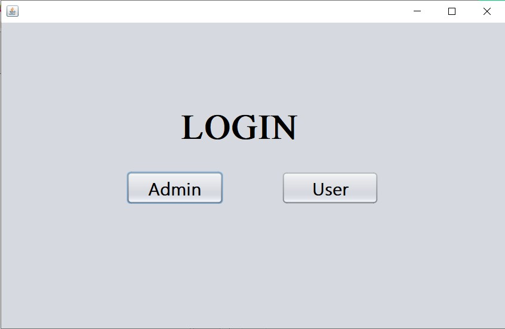
<h3  align='center'>- Admin Panel -</h3>

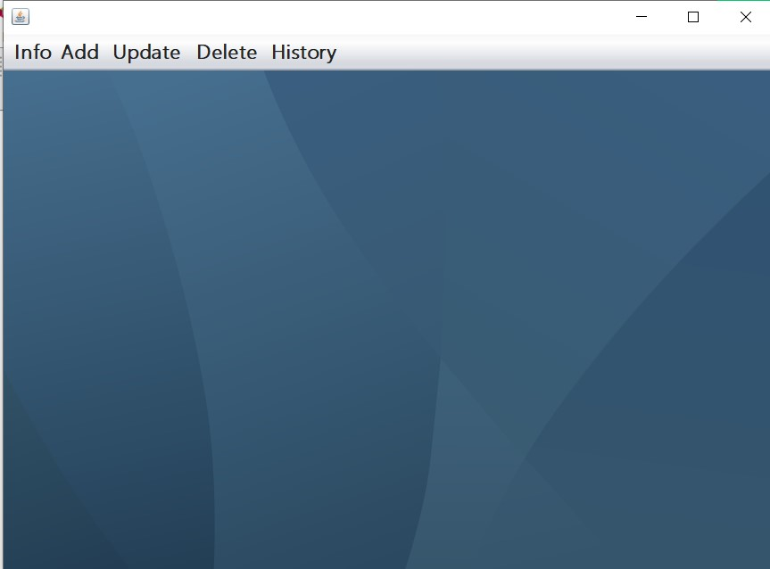

<h3  align='center'>Books info</h3>

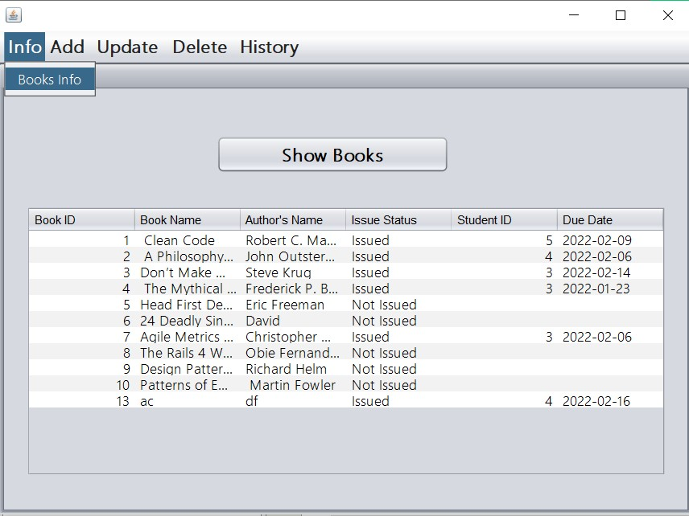
<h3  align='center'>Add Books</h3>

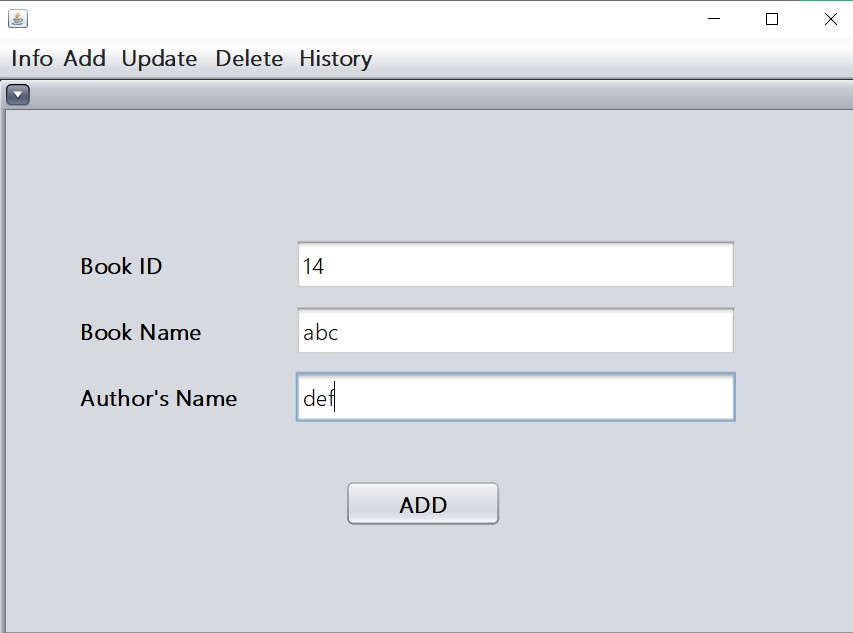

<h3  align='center'>Update Books</h3>

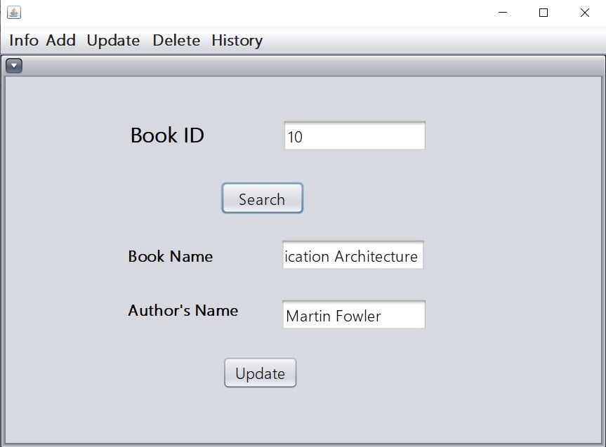

<h3  align='center'>Issue Book</h3>

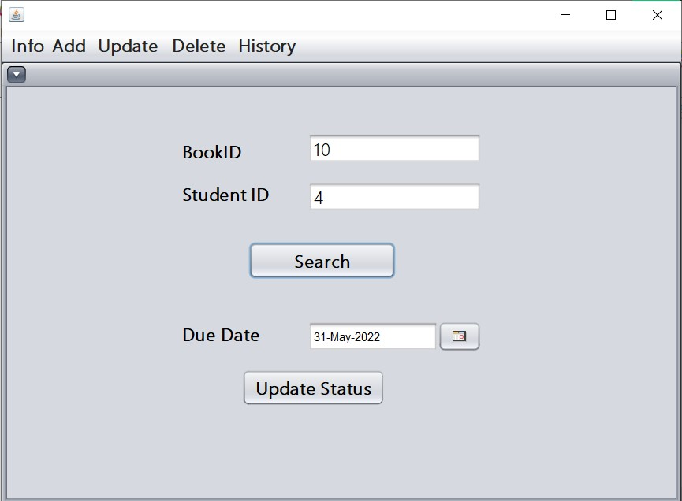
<h3  align='center'>Return Book</h3>

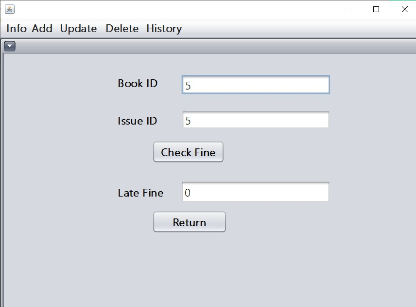
<h3  align='center'>Delete Book</h3>

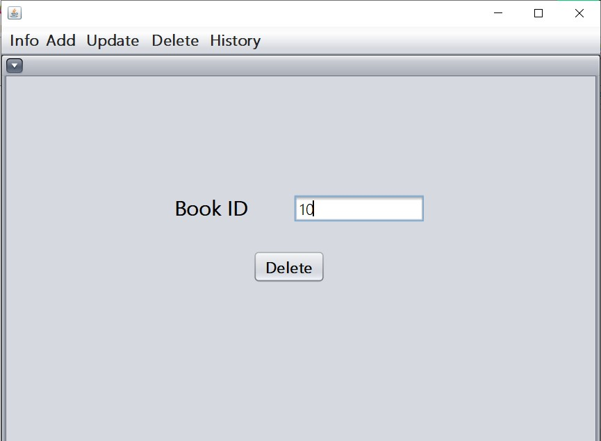
<h3  align='center'>Student Status</h3>

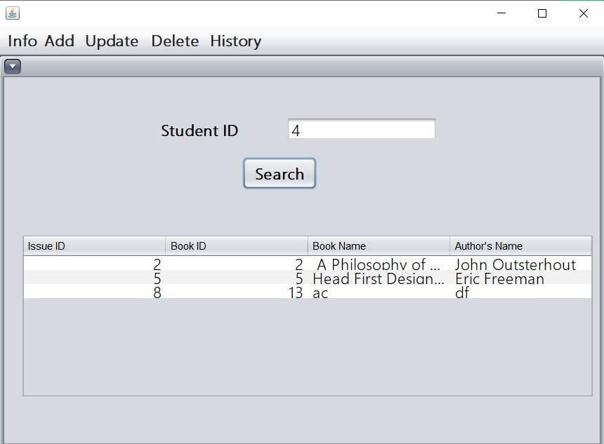
<h3  align='center'>Book History</h3>

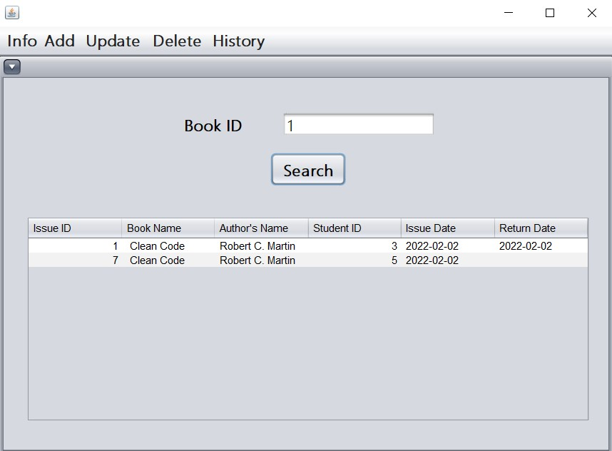
<h3  align='center'>Issue History</h3>

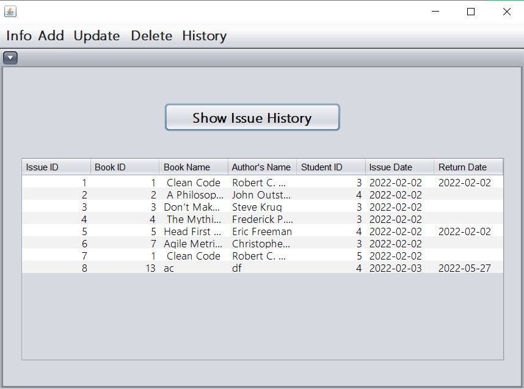
<h3  align='center'>- User Panel -</h3>

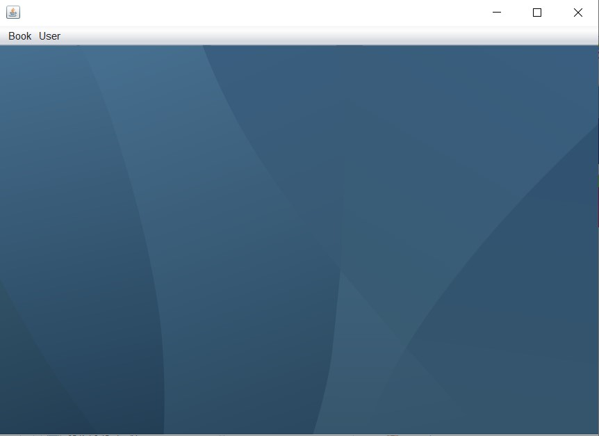
<h3  align='center'>Book Status</h3>

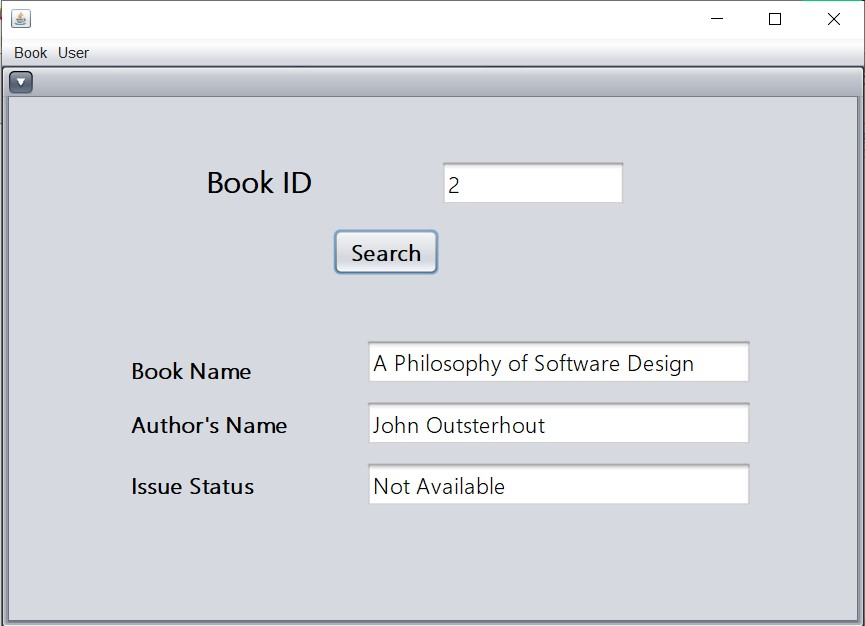
<h3  align='center'>My Books Status</h3>

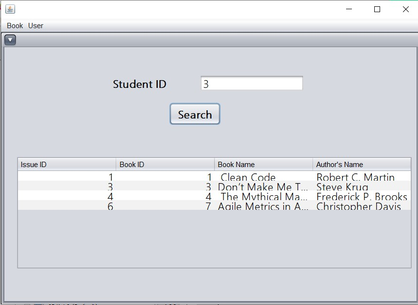
